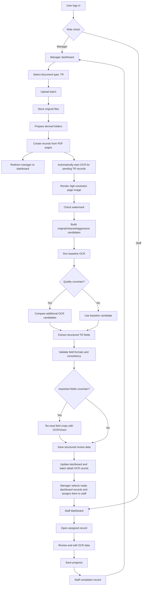

# Target Flow: Role-Based TR OCR Review

## 1. System Goal

Redesign the app into a role-based OCR review system for TR documents.

The revised Phase 1 target workflow is:

1. A manager logs in.
2. The manager selects `document_type = TR`.
3. The manager uploads TR PDF files.
4. The backend creates an upload batch.
5. The backend saves original uploaded files under original storage.
6. The backend prepares derived folders.
7. The backend creates one review record per PDF page.
8. As soon as page records are created successfully, the backend automatically starts the TR OCR pipeline for pending records.
9. The OCR pipeline checks whether each page has a watermark.
10. If watermark exists, the system saves a cleaned image as one OCR candidate.
11. OCR compares the useful candidates, such as original, cleaned, and aggressive images, instead of trusting one source blindly.
12. Successful OCR records become ready for assignment.
13. The manager is redirected back to the manager dashboard and can monitor OCR progress in the record table.
14. After OCR finishes, the manager selects ready records directly from the dashboard table and assigns them to staff.
15. Staff reviews and completes assigned records.
16. The manager monitors batches, OCR progress, review progress, and staff workload.

Accuracy target update:

The TR document is usually one page, but it is not a simple OCR page. It is a fixed-layout form with many high-value fields. The system should therefore treat TR processing as a structured form extraction pipeline, not as plain full-page OCR.

The accuracy-first target is:

1. Preserve the original uploaded PDF.
2. Render a high-resolution page image.
3. Build multiple OCR input candidates, such as original, watermark-cleaned, and aggressive black/white.
4. Run OCR or vision extraction on more than one candidate when quality is uncertain.
5. Extract TR fields into structured data.
6. Validate each field with deterministic rules.
7. Re-read only uncertain fields with field crop OCR or Vision vision extraction.
8. Show staff the original preview plus structured fields, with suspicious fields highlighted first.

Current implementation status:

- PR 1 completed auth and role-based routing with `TUser.Role_ocr`.
- PR 2 completed manager TR upload UI foundation.
- PR 3 completed backend upload batch foundation and original/derived storage setup.
- Combined PR 4 + PR 5 completed PDF page-to-record creation, automatic TR OCR after upload, and manager batch detail UX.
- PR 6 completed manager assignment from batch detail for OCR-success unassigned TR records.
- PR 7 completed staff review integration for assigned records using a left/right review layout.
- PR 8 moved the primary manager assignment workflow to the dashboard record table with selected-record assignment.
- Current update completed the TR-specific staff review screen at `/tr-imports/{recordId}?source=staff`, a staff dashboard table, staff completion redirect back to `/staff`, and TR `เน€เธชเธตเธขเธŠเธตเธงเธดเธ•` flag display when OCR text contains `เธ•เธฒเธข`.

OCR handoff update, 2026-05-15:

- TR OCR/parser accuracy work is in progress and should be continued before trusting bulk production results.
- `server/app/tr_review.py` now uses `TR_REVIEW_VERSION = 5`.
- `server/app/import_pipeline.py` now uses `TR_IMPORT_OCR_PIPELINE_VERSION = 80`.
- TR parent parsing was hardened for fixed-layout rows where mother/father data appears as `motherName - nationality` followed by `fatherName fatherId nationality`, including rows split across many OCR lines.
- The parser now avoids using a secondary parent ID as `motherId` when the source shows mother ID as `-`.
- The manager upload OCR path now builds a cleaned TR page image even when watermark detection reports `none`, because light diagonal TR watermarks can still confuse Thai names.
- OCR candidate handling in the manager path now compares original and cleaned image candidates instead of relying only on the original when watermark detection is weak.
- Vision/Vision now works as a candidate verifier after OCR/parser extraction for `personName`, `motherName`, `fatherName`, and `address`.
- Vision/Vision verification checks the OCR candidate against the locked field crop from the original image first, then falls back to the cleaned crop.
- Guard logic rejects Vision name values that look like they accidentally include neighboring row text, for example rejecting `เธชเธกเธžเธฃ เธ™เธˆเธฃ` when the parser already had valid `เธชเธกเธžเธฃ`.
- Follow-up fix: parent name fields (`motherName`, `fatherName`) are verified against their OCR/parser candidate from the locked parent row crop; they are no longer blindly overwritten by free-form Vision extraction.
- Follow-up fix: if Vision/Vision returns multiple tokens for a parent name field, such as `เธ›เธดเธ”เธ—เธงเธต เน€เธˆเธฃเธดเธ`, the value is rejected because it likely includes neighboring row text.
- Follow-up fix: `personName`, `motherName`, `fatherName`, and `address` all run through Vision/Vision candidate verification before final review data is stored when the vision endpoint is available.
- Follow-up fix: TR name values now pass through a shared Thai-name normalizer in parser, manager Vision rescue, and import vision verification. It applies reusable OCR artifact repairs such as `เธฃเนŒเธญ -> เธฃเนˆเธญ` and user-confirmed token corrections such as `เธ“เธจเธดเธฅเธ”เธฒ -> เธ“เธจเธดเธฅเธ•เธฒ`, `เธˆเธธเธ›เธฃเธฐเน€เธชเธฃเธดเธ -> เธˆเธนเธ›เธฃเธฐเน€เธชเธฃเธดเธ`, and `เธ„เธณเธฃเธดเธง/เธ„เนเธฒเธฃเธดเธง -> เธ„เธณเธฃเธดเน‰เธง` across every rebuilt record.
- Follow-up fix: TR address values now pass through an address-specific normalizer for user-confirmed OCR token corrections such as `เน„เธกเน‰เธ”เธณ -> เน„เธœเนˆเธ•เนˆเธณ`.
- Follow-up fix: TR review data now records `qualityIssues` and field `alternatives` when multiple OCR text sources disagree on high-risk Thai name fields, so future UI work can surface uncertain names instead of silently trusting one model output.
- Normal import detail loading can rebuild stale TR `review_data` when the stored review version is old or has not passed the vision field review step.
- Server-side generated OCR files were cleared from `server/data_storage/incoming` and `server/data/storage` so the next run can start clean. The user will clear the database manually.
- Backend/OCR was intentionally left stopped after cleanup. Frontend dev server may still be running on port `3000`; backend port `8000` was left free.

Phase 1 supports only `selected_document_type = TR`.

Phase 1 does not validate whether uploaded files are actually TR documents. The manager-selected `selected_document_type = TR` is treated as the source of truth. Actual document type validation and classification are deferred to a future phase.

Original uploaded files must never be modified because they will later be used for external system delivery. OCR may use derived files when watermark cleaning is needed.

## 2. Roles and Permissions

### Manager

Managers can:

- Log in and access the manager dashboard.
- Select document type before upload.
- Upload TR PDF files.
- Upload up to 20 files per batch.
- Upload one PDF with up to 20 pages.
- Create one review record per PDF page.
- Assign OCR-success records to staff users.
- See all batches.
- See all records.
- See OCR status.
- See review status.
- See staff workload.

### Staff

Staff can:

- Log in and access the staff dashboard.
- See only records assigned to them.
- Review OCR results.
- Edit or correct OCR data.
- Save progress.
- Mark records as completed.
- See their own total, completed, and remaining task counts.

### Permission Boundaries

- Staff must not see unassigned records.
- Staff must not see records assigned to other staff users.
- Staff must not upload documents.
- Staff must not trigger OCR retries or manager-only processing actions.
- Staff must not assign records.
- Staff must not access manager dashboard views.
- Managers can see all records and assignment state.

Needs confirmation:

- Whether managers can review or edit OCR results directly.
- Whether managers can reassign records after staff review has started.
- Whether staff can return a task to manager or flag a task as blocked.

## 3. Manager Dashboard Flow

1. Manager logs in.
2. System redirects manager to `/manager`.
3. Manager sees dashboard summary:
   - Total batches.
   - Total records.
   - OCR pending count.
   - OCR processing count.
   - OCR failed count.
   - OCR succeeded count.
   - Review pending count.
   - Assigned count.
   - In review count.
   - Completed count.
   - Staff workload summary.
4. Manager can open upload flow.
5. Manager selects document type.
6. Phase 1 allows only `TR`.
7. Manager uploads PDF files.
8. System creates one batch.
9. System stores original files without modification.
10. System prepares derived storage folders.
11. System creates one record per PDF page.
12. As soon as records are created successfully, the system automatically starts OCR for records where `selected_document_type = TR` and `ocr_status = pending`.
13. System redirects manager back to `/manager`.
14. Manager monitors OCR progress and file/record status in the dashboard record table.
15. Manager selects OCR-success unassigned records from the dashboard record table and assigns the selected records to staff after OCR finishes.
16. Manager can still open batch detail from the dashboard to inspect file, OCR, and batch-level status.

Recommended manager dashboard sections:

- Batch list.
- Batch detail for inspection and operational drill-down.
- Record list with filters.
- OCR failures.
- Assignment queue.
- Staff workload.

## 4. Staff Dashboard Flow

1. Staff user logs in.
2. System redirects staff user to `/staff`.
3. Staff dashboard shows only records assigned to the current staff user.
4. Staff dashboard summary shows:
   - Total assigned records.
   - Completed records.
   - Remaining records.
   - In-progress records.
5. Staff opens a record.
6. Staff reviews structured TR fields and the original page preview.
7. Staff edits corrected OCR data.
8. Staff saves progress.
9. Staff confirms all fields are checked.
10. Backend stores corrected structured TR fields and marks the record as `completed`.
11. Staff is redirected back to `/staff`.
12. Completed records remain visible in the staff dashboard table as completed history and no longer count as remaining work.

Current staff frontend behavior:

- `/staff` shows assigned records in a table, including file name, page number, OCR status, review status, assignment time, and an Open/View action.
- Staff opens assigned TR records through `/tr-imports/{recordId}?source=staff`.
- The TR review screen shows the original page preview on the left for readability.
- Watermark-cleaned images are OCR inputs, not the primary human review preview.
- TR fields are shown in a compact form-style layout matching the source TR document order.
- Staff can edit individual fields with `EDIT`.
- Staff completes the record with `เธขเธทเธ™เธขเธฑเธ™เธงเนˆเธฒเธ•เธฃเธงเธˆเธ„เธฃเธšเนเธฅเน‰เธง`; after success the UI redirects back to `/staff`.
- If TR OCR text contains `เธ•เธฒเธข`, review data stores `flags.deceased = true` and the UI shows a `เน€เธชเธตเธขเธŠเธตเธงเธดเธ•` badge beside the completion action.

Needs confirmation:

- Whether completed records remain editable.
- Whether save progress requires partial validation.
- Whether staff can flag OCR quality issues.

## 5. Login and Role Redirect Flow

1. User submits login credentials.
2. Backend authenticates the user.
3. Backend returns user identity and role.
4. Frontend stores the authenticated session.
5. Frontend redirects by OCR role:
   - `manager` -> `/manager`
   - `staff` -> `/staff`
6. Protected pages check session and role.
7. Unauthorized users are redirected or shown an access denied state.

Needs confirmation:

- Session mechanism details for production hardening.
- Whether there are admin users beyond manager and staff.

## 6. TR Upload Flow

1. Manager opens upload page.
2. Manager selects `document_type = TR`.
3. Manager uploads PDF files.
4. Client validates basic file constraints.
5. Backend requires authenticated manager access.
6. Backend creates an upload batch.
7. Backend stores original files under original storage.
8. Backend prepares derived storage folders.
9. Backend detects PDF page counts.
10. Backend creates one record per PDF page.
11. Backend writes `records_created` batch metadata and persists the batch/file/page review records to SQL Server.
12. Backend automatically starts OCR for pending TR records after page-to-record creation succeeds.
13. Frontend redirects manager back to `/manager`, where the new records appear in the dashboard table.

Phase 1 upload rules:

- Phase 1 trusts manager-selected `document_type = TR`.
- Actual TR document validation is deferred.
- Original files are preserved for future external system delivery.
- Original files must never be modified.
- Derived folders are used for generated page assets, watermark-cleaned files, previews, and OCR outputs.

Upload constraints:

- Manager must select document type before upload.
- Phase 1 supports only `TR`.
- Files must be PDFs.
- Batch upload supports up to 20 files.
- Single PDF upload supports up to 20 pages.
- Each page of a multi-page PDF becomes one record.
- A PDF with more than 20 pages is marked `page_limit_exceeded`; that file does not create review records and does not run OCR.

Needs confirmation:

- Whether a batch may contain fewer than 10 files in production.
- Maximum file size per file.
- Whether image uploads are future scope.

## 7. Deferred: Document Type Validation Flow

This flow is not implemented in Phase 1.

Phase 1 does not classify whether uploaded files are actually TR documents. The selected document type from manager upload is the source of truth.

Future phases may add actual document classification and `invalid_document_type` handling.

Future validation flow may include:

1. Store manager-selected document type as `selected_document_type`.
2. Run document classifier or validation logic.
3. Store classifier result as `detected_document_type`.
4. If actual document type does not match selected type, mark item as `invalid_document_type`.
5. Prevent OCR or route item to a manager exception queue.

Needs confirmation:

- How TR document validation should be implemented.
- Whether validation uses OCR, visual classifier, rule-based text detection, template matching, or metadata.
- Whether validation happens per uploaded file or per PDF page.

## 8. PDF Page-to-Record Flow

TR documents are usually one page per record.

One PDF page equals one review record.

When a manager uploads a PDF:

1. Backend checks total PDF pages.
2. If page count is greater than 20, reject that PDF or mark it with a page limit error.
3. Backend creates records before OCR.
4. Each valid page becomes one review record.
5. Records start with:
   - `ocr_status = pending`
   - `review_status = unassigned`
6. No assignment happens until OCR succeeds.

After all records for the upload are created successfully, the backend automatically starts OCR for pending TR records. There is no manual OCR start step in the normal Phase 1 manager workflow.

Each record stores:

- Record ID.
- Batch ID.
- File ID.
- Original filename.
- Selected document type.
- Page number.
- Original file path.
- Derived root.
- Page asset path or `null` if page asset generation is deferred.
- Cleaned page path, initially `null`.
- Watermark flag, initially `null`.
- OCR status.
- Review status.
- Assigned user, initially `null`.
- OCR error, initially `null`.
- Processed timestamp, initially `null`.
- Optional structured TR `review_data`, including extracted fields and flags such as `deceased`.

Example:

- One 5-page PDF creates 5 records.
- Page 1 creates record 1.
- Page 2 creates record 2.
- Page 5 creates record 5.
- One 20-page PDF creates 20 records.
- Page 1 creates record 1.
- Page 2 creates record 2.
- Page 20 creates record 20.

Current implementation check:

- The manager upload endpoint counts pages with `pypdf`.
- For each PDF where `page_count <= 20`, it loops from page 1 through `page_count` and creates one review record per page.
- A single uploaded 5-page PDF is therefore supported as 5 independent review records in one batch.
- Each record keeps the same `file_id` and `original_path`, but has a unique `record_id` and its own `page_number`.
- Automatic OCR processes all pending records in the batch, including all pages from a multi-page PDF.
- Manager dashboard selected-record assignment can assign those page records individually or together.
- Staff dashboard lists each assigned page record separately.

Needs confirmation:

- Whether a PDF with more than 20 pages should be rejected entirely or partially accepted up to page 20.

Current Phase 1 decision:

- A PDF with more than 20 pages is not OCRed.
- The file is marked `page_limit_exceeded`.
- Other valid files in the same batch may still create records and continue to automatic OCR.

## 9. OCR Pipeline Flow

OCR is triggered automatically after upload and page-to-record creation succeeds.

For records where `selected_document_type = TR` and `ocr_status = pending`:

1. Record enters the OCR queue or automatic OCR processing.
2. System marks record as OCR processing.
3. System locates the original PDF and page number.
4. System renders a high-resolution page asset from the original PDF.
5. System checks whether the page has a watermark.
6. System builds OCR candidate images:
   - `original`: the rendered page image.
   - `cleaned`: watermark-cleaned image when watermark is detected.
   - `aggressive`: optional black/white or thresholded image when text quality looks poor.
7. System saves each generated candidate under derived storage.
8. System runs OCR on the best baseline candidate first.
9. If baseline OCR looks suspicious, system compares additional candidates instead of trusting one image.
10. System extracts structured TR fields from the best OCR result.
11. System validates extracted fields with deterministic rules.
12. If important fields are missing, invalid, or disagree across candidates, system re-reads only those fields using crop-based OCR or a vision model such as Vision.
13. System merges field-level results into one structured `review_data` payload.
14. If OCR succeeds:
   - Save raw OCR candidate outputs.
   - Save selected OCR result.
   - Save structured TR review data.
   - Save field confidence, validation issues, and selected source per field where possible.
   - Set `review_data.flags.deceased = true` when OCR text or structured fields indicate `เธ•เธฒเธข`.
   - Update the SQL Server review record for the page.
   - Save OCR output or reference under derived storage and/or record metadata.
   - Set `ocr_status = succeeded`.
   - Set `ocr_quality = auto_verified`, `needs_review`, or `low_confidence`.
   - Keep `review_status = unassigned` until manager assignment.
15. If OCR fails:
   - Set `ocr_status = failed`.
   - Save `ocr_error`.
   - Do not assign to staff.

Accuracy-first OCR principles:

- Do not use watermark-cleaned output as the only OCR source.
- Treat cleaned images as candidates because cleaning can remove Thai tone marks, small strokes, or faint text.
- Prefer field-level validation over full-page confidence.
- A record can be OCR-successful but still require staff review for specific fields.
- The staff UI should make suspicious fields obvious so staff corrects fewer values.

Current TR OCR behavior implemented during the 2026-05-15 accuracy pass:

- Manager upload OCR calls `build_tr_cleaned_image(page_image)` for every TR record, not only when watermark detection is positive.
- `compare_ocr_page_sources(...)` is used with both original and cleaned page images when the cleaned image exists.
- The selected full-page OCR candidate can still be `original`; cleaned is a candidate and a field crop source, not a forced replacement.
- Vision field verification now runs after OCR/parser candidate extraction for `personName`, `motherName`, `fatherName`, and `address`.
- Vision receives the locked field crop plus the OCR candidate and must return `correct`, `incorrect`, or `uncertain`.
- Vision verification uses the original crop first and the cleaned crop as fallback.
- Vision/vision results are stored in `visionFieldVerification`, `visionFieldReview`, and `ocr_candidate_outputs.vision_rescued_fields` with actions such as `confirmed`, `corrected`, or `rescued`.
- Field source tracking is visible through `field_source_map` and each `review_data.fields[field].source`.
- If Vision returns a longer name that starts with the existing parsed name, the value is treated as likely neighboring text and is not accepted.
- If Vision returns more than one token for a parent name field, the value is rejected to avoid mixing mother and father rows.
- For name fields, if direct Vision JSON extraction fails, the crop is also reread with the OCR model as a fallback.

Manual OCR test notes from 2026-05-15:

- Record `be68c45714bb4cd49d18e9e3b7271baa`, `7.pdf` page 1:
  - `fatherName` improved from blank/`-` to `เธ‚เธˆเธฃ`.
  - `fatherId` remained `3-1101-00774-28-1`.
  - `motherName` stayed `เธชเธกเธžเธฃ`; bad Vision value `เธชเธกเธžเธฃ เธ™เธˆเธฃ` was rejected by the new guard.
  - `personName` is still imperfect. Latest Vision cleaned-crop result was `เธ™เธฒเธขเธญเธ™เธธเธชเธฃเธ“เนŒ เธญเนˆเธฒเน„เธฃเธˆเธดเธ‡`; the visually expected value appears closer to `เธ™เธฒเธขเธญเธ™เธธเธชเธฃเธ“เนŒ เธญเนˆเธณเน„เธฃเนˆเธ‚เธดเธ‡`. This case still needs better crop bounds, prompt tuning, or manual correction.
- Record `fb6e3075442644a9a374460297af9a98`, `7.pdf` page 2:
  - `personName` corrected to `เธ™เธฒเธขเธ˜เธตเธฃเธงเธฑเธ’เธ™เนŒ เธˆเธนเธ›เธฃเธฐเน€เธชเธฃเธดเธ`.
  - `fatherName` recovered as `เนเธชเธ‡เธ›เธฃเธฐเธ—เธฑเธข`.
  - `fatherId` remained `3-7403-00317-67-9`.
  - `motherName` stayed `เธ—เธญเธ‡เนเธ”เธ‡`; bad Vision value `เธ—เธญเธ‡เนเธ”เธ‡ เนเธชเธ‡เธ›เธฃเธฐเธ—เธฑเธข` was rejected.

Known remaining OCR risks:

- Thai name fields with visually similar characters or tone marks can still be wrong even after Vision cleaned-crop verification.
- The current name crop boxes may be too wide for parent rows, causing neighboring parent names to leak into Vision output.
- The watermark detector can under-report light TR watermark overlays, so cleaned-candidate generation should stay enabled for all TR pages.
- The selected full-page OCR source may still be original even if cleaned crop gives better field values; field-level source metadata is therefore more reliable than page-level selected source for final review.

Watermark handling decision:

The system should distinguish between `no_watermark`, `weak_watermark`, and `strong_watermark`.

- `no_watermark`: No meaningful overlay is detected. OCR should use the original high-resolution page image first.
- `weak_watermark`: A watermark is visible, but the printed text is still readable and the watermark is light or does not strongly cover important fields. OCR should still try the original image first, then compare cleaned output if validation fails or confidence is low.
- `strong_watermark`: The watermark overlaps important fields, creates repeated OCR noise, or makes values hard to read. OCR should create cleaned and aggressive candidates, then choose field-level values using validation.

Important rule:

- A page can visibly have a watermark and still be better read from the original image.
- A cleaned page is useful when the watermark blocks OCR, but it can also damage Thai tone marks, small dots, faint strokes, signatures, and thin printed lines.
- Therefore `has_watermark = true` should not automatically mean `ocr_input_path = cleaned_page_path`.
- The selected OCR source should be chosen by field validation and candidate comparison, not by watermark detection alone.

Recommended TR field validation:

- `personId`, `motherId`, and `fatherId` must match Thai citizen ID format.
- `houseCode` must match house code format.
- `gender` must be one of the supported values.
- `nationality` fields must be known values such as Thai.
- `birthDate`, `moveInDate`, and `updateDate` must match Thai date format.
- `age` must be numeric and consistent with birth/update dates when both dates are available.
- `personName`, `motherName`, and `fatherName` must not contain ID numbers or date fragments.
- `address` should contain address-like tokens and should not include footer, registrar, or watermark text.

Citizen ID and house code input policy:

- Staff should be able to enter citizen IDs either with hyphens or as 13 plain digits.
- The review UI should auto-format a valid 13-digit citizen ID for readability, such as `110200850551` -> `1-1020-00850-55-1`.
- Staff should be able to enter house codes either with hyphens or as 11 plain digits.
- The review UI should auto-format a valid 11-digit house code for readability, such as `10410103165` -> `1041-010316-5`.
- The review payload may keep the display-friendly hyphenated value.
- SQL Server insert/export should normalize citizen IDs and house codes to compact digit-only values because the target database does not store hyphens.
- Validation should accept both formats as long as the compact digit count is correct.
- If a parent ID is truly absent and the source shows `-`, keep `-` in the review UI but store an empty or null compact value according to the target database contract.

Recommended OCR quality states:

- `auto_verified`: required fields pass validation and candidate disagreement is low.
- `needs_review`: OCR succeeded but one or more fields need human attention.
- `low_confidence`: OCR output is too short, invalid, or inconsistent; assignment is allowed only if the manager accepts manual review.

Needs confirmation:

- Whether OCR failure records can be retried by manager.
- Whether OCR output should be raw text, structured TR fields, or both.
- Whether `low_confidence` records should be assignable or should require manager retry first.
- Whether Vision vision extraction should be used only for uncertain fields or for all records.

## 10. Assignment Flow

Assignment happens after OCR succeeds, not during upload.

Assignment is implemented primarily from the manager dashboard record table.

1. Manager returns to `/manager` after upload.
2. Dashboard polling shows OCR progress in the TR Records table.
3. When OCR succeeds, rows where `ocr_status = succeeded` and `review_status = unassigned` become selectable.
4. Manager selects one or more ready records from the dashboard table.
5. Manager clicks `Assign Selected`.
6. Manager selects one staff user in the assignment modal.
7. Backend assigns exactly the selected record IDs to the staff user.
   - Update assignment fields in SQL Server for each selected review record.
8. Assigned records become visible in that staff user's dashboard.
9. Dashboard and batch assignment counts update.

Recommended assignment rules:

- Manager can assign only records where `ocr_status = succeeded` and `review_status = unassigned`.
- OCR failed records should not be assigned.
- Records still pending or processing OCR should not be assigned.
- Records already assigned should not be assigned again.
- Completed records should not be reassigned by default.
- Primary assignment should happen from the dashboard record table after OCR completes.
- Batch detail assignment can remain as a secondary batch-level shortcut, but selected-record assignment is the default manager workflow.

Needs confirmation:

- Whether records can be bulk-assigned automatically.
- Whether manager can unassign records.
- Whether manager can reassign records after staff starts review.

## 11. Staff Review Flow

1. Staff opens assigned record.
2. System marks review status as `in_review` when review starts.
3. Staff sees:
   - Source page preview.
   - OCR result.
   - Editable correction fields.
   - Save action.
   - Complete action.
4. Staff edits OCR data.
5. Staff saves progress.
6. System stores corrected data and keeps status as `in_review`.
   - Corrected data is stored in SQL Server so the review UI and downstream export read the same source of truth.
7. Staff marks completed.
8. System validates required fields.
9. If valid, record status becomes `completed` and `save_btn` becomes `Y`.
10. Staff dashboard counts update.

Current PR 7 behavior:

- Staff dashboard lists only records assigned to the current staff user.
- Staff opens assigned records from `/staff/records/{recordId}`.
- Backend rejects unassigned records, OCR failed records, and records assigned to another staff user.
- Staff review page keeps the existing review pattern: source preview on the left and OCR/correction controls on the right.
- Save Progress stores `corrected_result`, keeps assignment metadata, and sets `review_status = in_review`.
- Mark Completed stores final correction data and sets `review_status = completed`.

Needs confirmation:

- Required TR fields.
- Whether review data is free text, structured fields, or both.
- Whether completion needs manager approval.
- Whether audit history is required for edits.

## 12. Recommended Record Statuses

Recommended Phase 1 record-level statuses:

- `uploaded`
- `records_created`
- `ocr_pending`
- `watermark_checking`
- `watermark_cleaning`
- `ocr_processing`
- `ocr_failed`
- `assigned`
- `in_review`
- `completed`

Recommended separate status fields:

- `ocr_status`: `pending`, `processing`, `succeeded`, `failed`
- `review_status`: `unassigned`, `assigned`, `in_review`, `completed`

Deferred statuses:

- `validating_document_type`
- `invalid_document_type`
- `validation_failed`

Needs confirmation:

- Whether the app should use one combined status or separate OCR and review statuses.

## 13. Recommended Batch Statuses

Recommended Phase 1 batch-level statuses:

- `uploaded`
- `records_created`
- `ocr_processing`
- `ocr_completed`
- `partially_failed`
- `failed`
- `assignment_ready`
- `completed`

Batch status can be derived from child record statuses.

Deferred batch logic:

- Invalid-document batch states are future work.
- `invalid_document_type` counts are future work.

Needs confirmation:

- Whether batch status should be stored or computed dynamically.
- Whether `assignment_ready` is explicit or derived from OCR-success records.

## 14. Draft Database Models

These models are draft targets for planning only.

### users

- `id`
- `username`
- `email` or display contact field, if available
- `display_name`
- `role` or `Role_ocr`: `manager` or `staff`
- `is_active`
- `created_at`
- `updated_at`

### upload_batches

- `id`
- `created_by_user_id`
- `selected_document_type`
- `status`
- `file_count`
- `total_pages`
- `record_count`
- `ocr_pending_count`
- `ocr_processing_count`
- `ocr_succeeded_count`
- `ocr_failed_count`
- `ready_to_assign_count`
- `completed_count`
- `created_at`
- `updated_at`

### uploaded_files

- `id`
- `batch_id`
- `original_filename`
- `stored_filename`
- `mime_type`
- `file_size_bytes`
- `original_path`
- `derived_root`
- `page_count`
- `status`
- `error_message`
- `created_at`
- `updated_at`

### review_records

- `id`
- `batch_id`
- `uploaded_file_id`
- `page_number`
- `selected_document_type`
- `ocr_status`
- `review_status`
- `assigned_to_user_id`
- `assigned_by_user_id`
- `assigned_at`
- `original_path`
- `derived_root`
- `page_asset_path`
- `cleaned_page_path`
- `ocr_input_path`
- `has_watermark`
- `watermark_score`
- `ocr_result`
- `ocr_quality`
- `ocr_candidate_outputs`
- `field_validation_issues`
- `field_source_map`
- `corrected_result`
- `save_btn`
- `ocr_error`
- `processed_at`
- `completed_at`
- `created_at`
- `updated_at`

Phase 1 storage path rules:

- `original_path` points to the original uploaded file.
- `original_path` is used for future external system delivery.
- Files referenced by `original_path` must never be modified.
- `derived_root` points to generated assets for one uploaded file.
- `page_asset_path` points to a derived page preview or page source when generated.
- `cleaned_page_path` is set only when watermark cleaning was applied.
- OCR should compare candidates when quality is uncertain. `cleaned_page_path` should not automatically replace the original as the only OCR source.
- `ocr_input_path` may point to the selected candidate, while `ocr_candidate_outputs` records all candidate attempts.
- `save_btn` starts as `N` when the review record is first inserted and changes to `Y` only after the user presses the final confirm button.

Deferred model fields:

- `detected_document_type`
- `document_status`
- `validation_error`

### review_events

- `id`
- `record_id`
- `actor_user_id`
- `event_type`
- `before`
- `after`
- `created_at`

Needs confirmation:

- Current database choice for the redesigned workflow.
- Whether existing collections should be migrated or new collections should be introduced.
- Whether audit events are required in Phase 1.

## 15. Draft API Endpoints

Authentication:

- `POST /api/auth/login`
- `POST /api/auth/logout`
- `GET /api/auth/me`

Manager:

- `GET /api/manager/dashboard`
- `GET /api/manager/batches`
- `GET /api/manager/batches/{batch_id}`
- `POST /api/manager/uploads`
- `GET /api/manager/records`
- `GET /api/manager/records/{record_id}`
- `POST /api/manager/records/assign`
- `POST /api/manager/records/{record_id}/retry-ocr`
- `GET /api/manager/staff-workload`

Current dashboard response should include:

- Dashboard totals: batch count, file count, record count, total pages.
- OCR totals: pending, processing, succeeded, failed, ready to assign.
- Review totals: unassigned, assigned, in review, completed.
- Recent batches.
- Flattened record summaries for the dashboard table, including filename, page number, OCR status, review status, watermark state, assignment state, and batch link.
- Dashboard assignment uses selected record IDs and calls `POST /api/manager/records/assign`.

Optional admin/retry endpoint only:

- `POST /api/manager/batches/{batch_id}/process-ocr`

Phase 1 normal UX must not require `POST /api/manager/batches/{batch_id}/process-ocr`. Upload completion and successful page-to-record creation should automatically start OCR for pending TR records. If retained, this endpoint is for admin retry, recovery, or operational backfill only.

Current batch detail response should include:

- Batch identity and status: `batch_id`, `selected_document_type`, `status`.
- Batch counts: `file_count`, `total_pages`, `record_count`.
- OCR counts: `ocr_pending_count`, `ocr_processing_count`, `ocr_succeeded_count`, `ocr_failed_count`, `ready_to_assign_count`.
- File summaries, including `page_limit_exceeded` errors.
- Record summaries, including page number, watermark state, OCR status, review status, and OCR errors.

Staff:

- `GET /api/staff/dashboard`
- `GET /api/staff/records`
- `GET /api/staff/records/{record_id}`
- `GET /api/staff/records/{record_id}/import`
- `GET /api/staff/records/{record_id}/preview`
- `PATCH /api/staff/records/{record_id}/progress`
- `POST /api/staff/records/{record_id}/complete`

Shared:

- `GET /api/records/{record_id}/preview`
- `GET /api/records/{record_id}/source`

Needs confirmation:

- Whether manager and staff APIs should be separated by path or enforced only by authorization checks.
- Whether endpoints should reuse existing `/api/imports` and `/api/jobs` routes or introduce new route groups.

## 16. Draft Frontend Pages

Authentication:

- `/login`

Manager:

- `/manager`
- `/manager/upload`
- `/manager/batches`
- `/manager/batches/[batchId]`
- `/manager/records`
- `/manager/records/[recordId]`
- `/manager/assignments`
- `/manager/staff-workload`

Staff:

- `/staff`
- `/staff/records`
- `/staff/records/[recordId]`
- `/tr-imports/[importId]?source=staff`
- `/staff/completed`

Needs confirmation:

- Final URL naming.
- Whether manager and staff should share one record detail component with role-specific actions.

Current manager frontend behavior:

- Successful upload redirects back to `/manager`.
- `/manager` shows dashboard totals, a record table, OCR status, review status, assignment state, and batch links.
- `/manager` polls dashboard data while OCR is pending or processing.
- `/manager/batches/[batchId]` is manager-only.
- Batch detail polls the batch detail API while OCR is pending or processing.
- Batch detail shows file counts, record counts, OCR counts, file-level errors, record OCR status, and `ready_to_assign_count`.
- `/manager` includes selectable ready rows, an `Assign Selected` action, a staff dropdown in the assignment modal, and selected-record assignment.
- Batch detail can still include a staff dropdown, count input, and assign button as a secondary batch-level shortcut.
- Dashboard assignment assigns exactly the selected ready records. Batch detail assignment assigns the first N ready records in the batch.
- Staff dashboard shows the current staff user's assigned records in a table with OCR/review status and Open/View actions.
- TR staff review uses `/tr-imports/[importId]?source=staff` and calls staff-owned endpoints with auth headers.

## 17. Validation Rules

Upload validation:

- User must be authenticated.
- User must have manager role.
- Document type is required.
- Phase 1 document type must be `TR`.
- Files must be PDFs.
- Maximum 20 files per batch.
- Single PDF maximum 20 pages.
- Files over 20 pages are marked `page_limit_exceeded` and skipped for OCR.
- File size must be within configured limit.

OCR validation:

- OCR runs only for records where `selected_document_type = TR` and `ocr_status = pending`.
- Watermark check runs before OCR.
- Watermark cleaning runs only when watermark exists.
- Watermark-cleaned output is a candidate, not the only possible OCR source.
- OCR should compare original, cleaned, and optional aggressive candidates when quality is uncertain.
- Required TR fields should be validated with deterministic field rules.
- Invalid or uncertain fields should be marked for staff review.
- OCR success must save OCR output.
- OCR success should save structured `review_data`.
- OCR success should save quality metadata where possible.
- OCR failure must save error information.
- OCR failed records must not be assigned to staff.

Assignment validation:

- Only manager can assign.
- Staff user must exist and be active.
- Record must have `ocr_status = succeeded`.
- Record must have `review_status = unassigned`.
- Pending, processing, failed OCR, already assigned, and completed records must not be assigned.

Staff review validation:

- Only assigned staff can open and edit a record.
- Only assigned staff can save progress.
- Only assigned staff can mark completed.
- Required corrected fields must be valid before completion.

Deferred document type validation:

- Actual TR classification is not implemented in Phase 1.
- `invalid_document_type` is future work.
- Future phases may classify actual document type and route non-TR files to an exception queue.

Needs confirmation:

- Required file extensions beyond PDF in future phases.
- Required TR fields.
- Whether manager can retry OCR failures.

## 18. Mermaid High-Level Flow Diagram

## 19. Suggested Implementation Phases

### Phase 1: Auth and Roles

- Add login.
- Add current user session.
- Add manager and staff roles.
- Add role-based redirects.
- Protect manager and staff pages.

### Phase 2: Manager Upload UI Foundation

- Add manager upload page.
- Require document type selection.
- Support Phase 1 document type `TR`.
- Validate PDFs and count limits in the UI.

### Phase 3: Backend Upload Batch Foundation

- Add manager upload endpoint.
- Store uploaded original files.
- Preserve original files without modification.
- Prepare derived storage folders.
- Create batch metadata.

### Phase 4: PDF Page-to-Record Foundation

- Detect PDF page count.
- Enforce maximum 20 pages per PDF.
- Create one review record per page.
- Start records with OCR pending and review unassigned state.
- Store initial `cleaned_page_path`, `has_watermark`, `ocr_error`, and `processed_at` as `null`.

### Phase 5: Auto TR Watermark Check + OCR Pipeline

- Automatically start OCR after upload and page-to-record creation succeeds.
- Redirect manager to `/manager` after upload succeeds.
- Add manager dashboard record table with polling OCR progress.
- Keep manager batch detail available for status inspection and operational drill-down.
- Check watermark per pending TR record.
- Clean watermark only when needed.
- Build original, cleaned, and optional aggressive OCR candidates.
- Do not rely on cleaned output as the only OCR input.
- Run OCR from the most appropriate candidate and compare candidates when quality is uncertain.
- Save OCR output and candidate metadata.
- Extract structured TR fields.
- Validate required TR fields.
- Mark field-level validation issues for staff review.
- Mark records as OCR succeeded or failed.
- Update `ready_to_assign_count` for OCR-success review-pending records.

### Phase 5A: Accuracy Hardening for TR One-Page Forms

- Increase OCR render resolution for TR pages.
- Add field-level validation for IDs, dates, house code, gender, nationality, age, and names.
- Add `ocr_quality` metadata.
- Add `field_validation_issues` metadata.
- Add candidate comparison in the manager upload OCR path.
- Add crop-based re-read for important fields that fail validation.
- Add Vision vision extraction as an optional second pass for uncertain fields.
- Highlight suspicious fields in the staff review UI.

Phase 5A current state, 2026-05-15:

- Partially implemented.
- Deterministic TR parser repairs and parent-row extraction are implemented in `server/app/tr_review.py`.
- Manager upload OCR uses original/cleaned comparison and Vision cleaned-crop verification in `server/app/manager_uploads.py`.
- Normal import review data refresh can run TR vision field verification in `server/app/import_pipeline.py`.
- Still needed:
  - Better crop boxes for parent/name rows.
  - Better confidence/disagreement scoring for when Vision and parser disagree.
  - UI highlighting for Vision-verified fields and rejected Vision values.
  - Manager retry UX for failed or low-confidence OCR.
  - A repeatable regression fixture set for known TR samples such as `7.pdf` page 1 and page 2.

### Phase 6: Assignment

- Add staff user list.
- Add manager dashboard selected-record assignment UI.
- Add selected-record assignment API.
- Assign only OCR-success records.
- Assign only unassigned records.
- Add staff assigned-record list.
- Add staff workload summary.

### Phase 7: Staff Review

- Add staff dashboard.
- Show only assigned records.
- Add review page.
- Add edit and save progress.
- Add complete action.
- Add staff task counts.
- Enforce staff ownership on detail, progress, and complete endpoints.

### Phase 8: Manager Monitoring

- Expand batch detail and monitoring beyond the initial combined PR 4 + PR 5 batch detail UX.
- Add record filters.
- Add OCR status monitoring.
- Add review status monitoring.
- Add OCR retry handling.

### Future Phase: Document Type Validation / Classification

- Classify actual uploaded document type.
- Add `detected_document_type`.
- Add `invalid_document_type` handling.
- Show document type exceptions in manager dashboard.
- Decide whether OCR should be blocked for classification failures.

Needs confirmation:

- Whether existing import/job models should be adapted or replaced.
- Whether document classification should run before OCR, after OCR, or as a separate review queue in a future phase.
