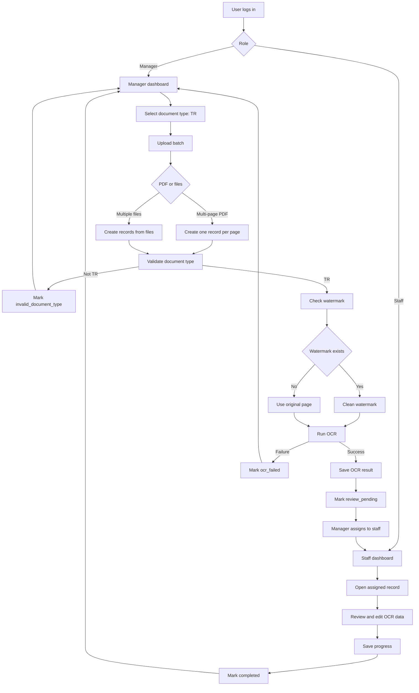

# Target Flow: Role-Based TR OCR Review

## 1. System Goal

Redesign the app into a role-based OCR review system for TR documents.

The target workflow is:

1. A manager logs in, uploads TR documents, and creates review records.
2. The system validates that uploaded files match the selected document type.
3. Valid TR pages are processed through the OCR pipeline.
4. OCR results become review tasks.
5. A manager assigns tasks to staff users.
6. Staff users review, correct, save, and complete assigned OCR records.
7. A manager monitors batches, records, OCR status, review status, invalid documents, and staff workload.

Phase 1 supports only TR documents.

## 2. Roles and Permissions

### Manager

Managers can:

- Log in and access the manager dashboard.
- Upload documents.
- Select document type before upload.
- Upload 10-20 files per batch.
- Upload one PDF with up to 20 pages.
- Create one review record per page when a multi-page PDF is uploaded.
- Assign records to staff users.
- See all batches.
- See all records.
- See OCR status.
- See review status.
- See staff workload.
- See invalid documents.

### Staff

Staff can:

- Log in and access the staff dashboard.
- See only records assigned to them.
- Review OCR results.
- Edit or correct OCR data.
- Save progress.
- Mark records as completed.
- See their own total, completed, and remaining task counts.

### Permission Boundaries

- Staff must not see unassigned records.
- Staff must not see records assigned to other staff users.
- Staff must not upload documents.
- Staff must not assign records.
- Staff must not access manager dashboard views.
- Managers can see all records and assignment state.

Needs confirmation:

- Whether managers can review or edit OCR results directly.
- Whether managers can reassign records after staff review has started.
- Whether staff can return a task to manager or flag a task as blocked.

## 3. Manager Dashboard Flow

1. Manager logs in.
2. System redirects manager to `/manager`.
3. Manager sees dashboard summary:
   - Total batches.
   - Total records.
   - OCR pending count.
   - OCR processing count.
   - OCR failed count.
   - Review pending count.
   - In review count.
   - Completed count.
   - Invalid document count.
   - Staff workload summary.
4. Manager can open upload flow.
5. Manager selects document type.
6. Phase 1 allows only `TR`.
7. Manager uploads files.
8. System creates one batch.
9. System validates document type.
10. System creates records for valid TR pages.
11. System runs OCR for valid TR records.
12. Manager can assign records to staff.
13. Manager can monitor all records and batch status.

Recommended manager dashboard sections:

- Batch list.
- Record list with filters.
- Invalid documents.
- Assignment queue.
- Staff workload.
- OCR failures.

## 4. Staff Dashboard Flow

1. Staff user logs in.
2. System redirects staff user to `/staff`.
3. Staff dashboard shows only records assigned to the current staff user.
4. Staff dashboard summary shows:
   - Total assigned records.
   - Completed records.
   - Remaining records.
   - In-progress records.
5. Staff opens a record.
6. Staff reviews OCR result and source page preview.
7. Staff edits corrected OCR data.
8. Staff saves progress.
9. Staff marks record as completed.
10. Completed record is removed from remaining queue or shown under completed filter.

Needs confirmation:

- Whether staff should see OCR failed records assigned to them.
- Whether completed records remain editable.
- Whether save progress requires partial validation.

## 5. Login and Role Redirect Flow

1. User submits login credentials.
2. Backend authenticates the user.
3. Backend returns user identity and role.
4. Frontend stores the authenticated session.
5. Frontend redirects by role:
   - `manager` -> `/manager`
   - `staff` -> `/staff`
6. Protected pages check session and role.
7. Unauthorized users are redirected or shown an access denied state.

Needs confirmation:

- Authentication method: username/password, OAuth, magic link, or another provider.
- Session mechanism: cookie session, JWT, or existing auth provider.
- Whether there are admin users beyond manager and staff.

## 6. TR Upload Flow

1. Manager opens upload page.
2. Manager selects document type.
3. Manager must select `TR` for Phase 1.
4. Manager selects files.
5. Client validates basic file constraints.
6. Backend creates an upload batch.
7. Backend stores original files.
8. Backend validates each file or page as TR.
9. Valid TR pages become review records.
10. Invalid documents are recorded with status `invalid_document_type`.
11. OCR runs only for valid TR records.
12. Manager dashboard shows both valid records and invalid documents.

Upload constraints:

- Manager must select document type before upload.
- Phase 1 supports only `TR`.
- Batch upload supports 10-20 files.
- Single PDF upload supports up to 20 pages.
- Each page of a multi-page PDF becomes one record.
- Non-TR documents must not run OCR.

Needs confirmation:

- Whether a batch may contain fewer than 10 files during testing.
- Whether a batch may contain mixed file types.
- Whether image uploads are allowed alongside PDFs.
- Maximum file size per file.

## 7. Document Type Validation Flow

1. Manager-selected document type is stored as `selected_document_type`.
2. Backend checks the actual document type.
3. If selected type is not `TR`, reject upload for Phase 1.
4. If selected type is `TR`, validate each uploaded document or PDF page.
5. If a document/page is confirmed as TR:
   - Create a normal review record.
   - Continue to OCR pipeline.
6. If a document/page is not TR:
   - Do not run OCR.
   - Create or update record as `invalid_document_type`.
   - Store validation reason if available.
   - Show item in manager dashboard.

Recommended validation outputs:

- `valid_tr`
- `invalid_document_type`
- `validation_failed`

Needs confirmation:

- How TR document validation should be implemented.
- Whether validation uses OCR, visual classifier, rule-based text detection, template matching, or metadata.
- Whether validation happens per uploaded file or per PDF page.

## 8. PDF Page-to-Record Flow

TR documents are usually one page per record.

When a manager uploads one multi-page PDF:

1. Backend checks total PDF pages.
2. If page count is greater than 20, reject the PDF or mark it invalid.
3. Backend splits processing by page.
4. Each page becomes one review record.
5. Each record stores:
   - Source batch ID.
   - Source file ID.
   - Page number.
   - Original file path.
   - Page preview or derived page asset path.
   - Document type.
   - OCR status.
   - Review status.

Example:

- One 20-page PDF creates 20 records.
- Page 1 creates record 1.
- Page 2 creates record 2.
- Page 20 creates record 20.

Needs confirmation:

- Whether a PDF with more than 20 pages should be rejected entirely or partially accepted up to page 20.
- Whether each page should have its own invalid document status if some pages are not TR.

## 9. OCR Pipeline Flow

For valid TR records:

1. Record enters OCR queue.
2. System checks whether the document page has a watermark.
3. If watermark exists:
   - Clean or remove watermark.
   - Use cleaned page for OCR.
4. If no watermark exists:
   - Use original page for OCR.
5. Run OCR.
6. If OCR succeeds:
   - Save OCR result.
   - Mark OCR status as `ocr_succeeded`.
   - Mark review status as `review_pending`.
7. If OCR fails:
   - Save error reason.
   - Mark OCR status as `ocr_failed`.
   - Do not mark as review pending.

Needs confirmation:

- Watermark detection method.
- Whether cleaned images should be persisted.
- Whether OCR failure records can be retried by manager.
- Whether OCR output should be raw text, structured TR fields, or both.

## 10. Assignment Flow

1. Manager opens assignment queue.
2. Manager filters records by status, batch, or staff.
3. Manager selects one or more records.
4. Manager selects staff user.
5. Backend assigns selected records to staff user.
6. Assigned records become visible in that staff user's dashboard.
7. Staff workload counts update.

Recommended assignment rules:

- Only records with `review_pending` or `in_review` should be assignable.
- Invalid document records should not be assignable.
- OCR failed records should not be assignable until retried or manually released.
- Completed records should not be reassigned by default.

Needs confirmation:

- Whether records can be bulk-assigned automatically.
- Whether manager can unassign records.
- Whether manager can assign records before OCR completes.

## 11. Staff Review Flow

1. Staff opens assigned record.
2. System marks review status as `in_review` when review starts.
3. Staff sees:
   - Source page preview.
   - OCR result.
   - Editable correction fields.
   - Save action.
   - Complete action.
4. Staff edits OCR data.
5. Staff saves progress.
6. System stores corrected data and keeps status as `in_review`.
7. Staff marks completed.
8. System validates required fields.
9. If valid, record status becomes `completed`.
10. Staff dashboard counts update.

Needs confirmation:

- Required TR fields.
- Whether review data is free text, structured fields, or both.
- Whether completion needs manager approval.
- Whether audit history is required for edits.

## 12. Recommended Record Statuses

Recommended record-level statuses:

- `created`: Record created before validation or OCR.
- `validating_document_type`: Document type validation is running.
- `invalid_document_type`: Uploaded document/page is not TR; OCR must not run.
- `ocr_pending`: Record is waiting for OCR.
- `watermark_checking`: Watermark detection is running.
- `watermark_cleaning`: Watermark removal is running.
- `ocr_processing`: OCR is running.
- `ocr_failed`: OCR failed.
- `review_pending`: OCR succeeded and record is ready for assignment or review.
- `assigned`: Record has been assigned to staff but not started.
- `in_review`: Staff review has started.
- `completed`: Staff completed review.

Alternative simplified model:

- `document_status`: `created`, `valid_tr`, `invalid_document_type`, `validation_failed`
- `ocr_status`: `not_started`, `pending`, `processing`, `succeeded`, `failed`
- `review_status`: `unassigned`, `assigned`, `in_review`, `completed`

Needs confirmation:

- Whether the app should use one combined status or separate document, OCR, and review statuses.

## 13. Recommended Batch Statuses

Recommended batch-level statuses:

- `created`: Batch created.
- `validating`: One or more files/pages are being validated.
- `processing`: One or more valid records are being processed by OCR.
- `review_ready`: At least one record is ready for review.
- `partially_failed`: Some records failed OCR or validation.
- `completed`: All valid records are completed.
- `invalid`: Entire batch has no valid TR records.

Batch status can be derived from child record statuses.

Needs confirmation:

- Whether batch status should be stored or computed dynamically.
- Whether invalid documents count toward batch completion.

## 14. Draft Database Models

These models are draft targets for planning only.

### users

- `id`
- `email`
- `display_name`
- `role`: `manager` or `staff`
- `is_active`
- `created_at`
- `updated_at`

### upload_batches

- `id`
- `created_by_user_id`
- `selected_document_type`
- `status`
- `file_count`
- `record_count`
- `invalid_count`
- `ocr_failed_count`
- `completed_count`
- `created_at`
- `updated_at`

### uploaded_files

- `id`
- `batch_id`
- `original_filename`
- `mime_type`
- `file_size_bytes`
- `storage_path`
- `page_count`
- `status`
- `created_at`
- `updated_at`

### review_records

- `id`
- `batch_id`
- `uploaded_file_id`
- `page_number`
- `selected_document_type`
- `detected_document_type`
- `document_status`
- `ocr_status`
- `review_status`
- `assigned_to_user_id`
- `assigned_by_user_id`
- `assigned_at`
- `original_page_path`
- `cleaned_page_path`
- `preview_path`
- `has_watermark`
- `ocr_result`
- `corrected_result`
- `validation_error`
- `ocr_error`
- `completed_at`
- `created_at`
- `updated_at`

### review_events

- `id`
- `record_id`
- `actor_user_id`
- `event_type`
- `before`
- `after`
- `created_at`

Needs confirmation:

- Current database choice for the redesigned workflow.
- Whether existing collections should be migrated or new collections should be introduced.
- Whether audit events are required in Phase 1.

## 15. Draft API Endpoints

Authentication:

- `POST /api/auth/login`
- `POST /api/auth/logout`
- `GET /api/auth/me`

Manager:

- `GET /api/manager/dashboard`
- `GET /api/manager/batches`
- `GET /api/manager/batches/{batch_id}`
- `POST /api/manager/uploads`
- `GET /api/manager/records`
- `GET /api/manager/records/{record_id}`
- `POST /api/manager/records/assign`
- `POST /api/manager/records/{record_id}/retry-ocr`
- `GET /api/manager/staff-workload`

Staff:

- `GET /api/staff/dashboard`
- `GET /api/staff/records`
- `GET /api/staff/records/{record_id}`
- `PATCH /api/staff/records/{record_id}/progress`
- `POST /api/staff/records/{record_id}/complete`

Shared:

- `GET /api/records/{record_id}/preview`
- `GET /api/records/{record_id}/source`

Needs confirmation:

- Whether manager and staff APIs should be separated by path or enforced only by authorization checks.
- Whether endpoints should reuse existing `/api/imports` and `/api/jobs` routes or introduce new route groups.

## 16. Draft Frontend Pages

Authentication:

- `/login`

Manager:

- `/manager`
- `/manager/upload`
- `/manager/batches`
- `/manager/batches/[batchId]`
- `/manager/records`
- `/manager/records/[recordId]`
- `/manager/assignments`
- `/manager/staff-workload`

Staff:

- `/staff`
- `/staff/records`
- `/staff/records/[recordId]`
- `/staff/completed`

Needs confirmation:

- Final URL naming.
- Whether manager and staff should share one record detail component with role-specific actions.

## 17. Validation Rules

Upload validation:

- User must be authenticated.
- User must have manager role.
- Document type is required.
- Phase 1 document type must be `TR`.
- Batch must contain 10-20 files.
- Single PDF must have no more than 20 pages.
- File type must be supported.
- File size must be within configured limit.

Document type validation:

- If selected document type is not `TR`, reject for Phase 1.
- If actual document/page is not TR, mark `invalid_document_type`.
- OCR must not run for invalid document type.

OCR validation:

- OCR runs only for valid TR records.
- Watermark check runs before OCR.
- Watermark cleaning runs only when watermark exists.
- OCR success must save OCR output.
- OCR failure must save error information.

Assignment validation:

- Only manager can assign.
- Staff user must exist and be active.
- Record must be assignable.
- Invalid document records must not be assigned.

Staff review validation:

- Only assigned staff can open and edit a record.
- Only assigned staff can save progress.
- Only assigned staff can mark completed.
- Required corrected fields must be valid before completion.

Needs confirmation:

- Required file extensions.
- Required TR fields.
- Whether manager can override validation outcomes.

## 18. Mermaid High-Level Flow Diagram

## 19. Suggested Implementation Phases

### Phase 1: Auth and Roles

- Add login.
- Add current user session.
- Add manager and staff roles.
- Add role-based redirects.
- Protect manager and staff pages.

### Phase 2: Manager Upload Foundation

- Add manager upload page.
- Require document type selection.
- Support Phase 1 document type `TR`.
- Create batch records.
- Store uploaded files.
- Enforce upload limits.

### Phase 3: PDF Page-to-Record Processing

- Detect PDF page count.
- Enforce maximum 20 pages per PDF.
- Create one review record per page.
- Generate page previews or page assets.

### Phase 4: TR Document Type Validation

- Validate actual document type.
- Mark non-TR documents as `invalid_document_type`.
- Prevent OCR for invalid documents.
- Show invalid documents in manager dashboard.

### Phase 5: TR OCR Pipeline

- Add watermark detection step.
- Add watermark cleaning step.
- Run OCR for valid TR records.
- Save OCR output.
- Mark records as `review_pending` or `ocr_failed`.

### Phase 6: Assignment

- Add staff user list.
- Add manager assignment UI.
- Add assignment API.
- Add staff workload summary.

### Phase 7: Staff Review

- Add staff dashboard.
- Show only assigned records.
- Add review page.
- Add edit and save progress.
- Add complete action.
- Add staff task counts.

### Phase 8: Manager Monitoring

- Add batch detail view.
- Add record filters.
- Add OCR status monitoring.
- Add review status monitoring.
- Add invalid document view.
- Add OCR retry handling.

Needs confirmation:

- Whether Auth + Role should be the first implementation PR after this documentation PR.
- Whether existing import/job models should be adapted or replaced.
